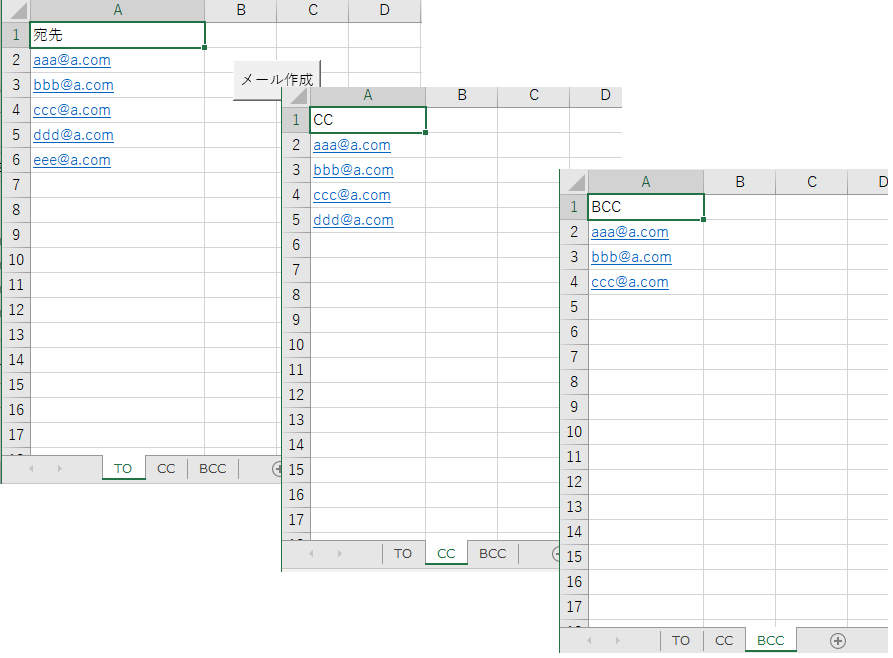
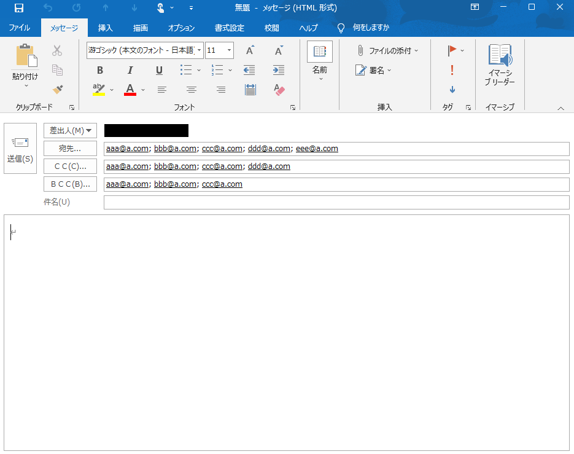

# Excelのリストから宛先、CC、BCCを一括指定してOoulookメールを作成するツール（ExcelVBA）

**目次**
 1. [動作検証環境](#1)
 2. [機能仕様](#2)
 3. [入手方法](#3)
 4. [使い方](#4)
 5. [更新履歴](#5)

 

##  1. 動作検証環境

|対象OS|必要ソフト|備考|
|--|--|--|
|Windows10|Excel2019、Outlook2019|旧バージョンのOfficeでも動作可|

##  2. 機能仕様

|機能|説明|備考|
|--|--|--|
|Ooulookの下書きメールを作成する|Excelのメールアドレスリストから宛先、CC、BCCを一括指定してOoulookメールを作成する|

##  3. 入手方法

1. ツール本体「宛先、CC、BCC一括指定ツール.xlsm」をダウンロード
1. xlsmファイルを開き、タブ「ツール」→「参照設定」より「Microsoft Outlook XX.0 Object Library」を有効にしておく

##  4. 使い方

1. 「TO」シートに宛先用、「CC」シートにCC用、「BCC」シートにBCC用のメールアドレスを記入します。 ※シート名は変更しないでくだい。 ※各シートのB列以降は特に使用しないため、自由に追加情報を記載してかまいません。
1. 入力後、「メール作成」ボタンをクリックします。
<!--  -->

1. Outlookが起動し、宛先、CC、BCCが指定済の下書きメールが表示されます。
<!--  -->

##  5. 更新履歴
|バージョン|更新日|更新内容|更新者|
|--|--|--|--|
|1.0.0.0|2021/09/12|新規作成|nuki|
